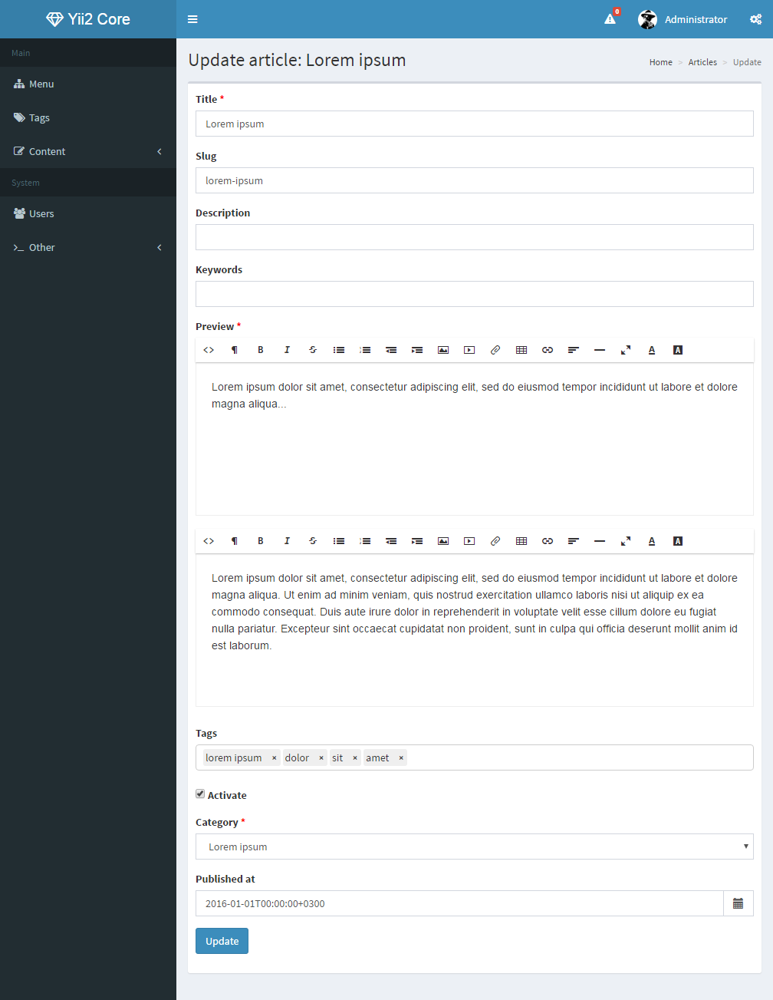
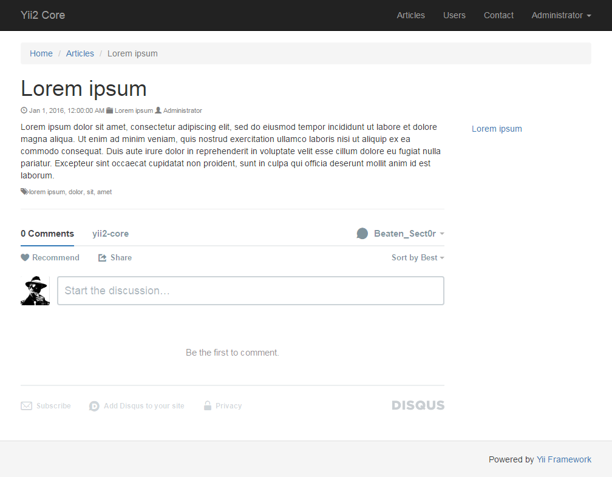

# Yii2 Core

Yii2 Core Project Template.

It was created and developing as a fast start for building an advanced sites based on Yii2. 

It covers typical use cases for a new project and will help you not to waste your time doing the same work in every project.

## Table of contents

- [Installation](docs/installation.md)
- [Features](#features)
- [Screenshots](#screenshots)

## Features

- Beautiful and open source dashboard theme for backend [AdminLTE 2](http://almsaeedstudio.com/AdminLTE)
- Translations: English, Russian
- Sign in, sign up, profile, email activation etc
- User management
- [RBAC](https://github.com/developeruz/yii2-db-rbac) with predefined `guest`, `user`, `manager` and `administrator` roles
- Content management components: articles, categories, tags, static pages, editable menu
- Useful behaviors (GlobalAccessBehavior, LastActionBehavior)
- Log web interface
- Cache web controller
- [DB manager](https://github.com/Beaten-Sect0r/yii2-db-manager)
- Maintenance mode component
- [Key storage component](https://github.com/trntv/yii2-starter-kit/tree/master/common/components/keyStorage)
- [dotenv support](https://github.com/vlucas/phpdotenv)
- [Sitemap and sitemap index builder](https://github.com/samdark/sitemap)
- [Imperavi reactor widget](https://github.com/vova07/yii2-imperavi-widget)
- [FileAPI widget](https://github.com/vova07/yii2-fileapi-widget)
- [Taggable behavior](https://github.com/creocoder/yii2-taggable)
- [Selectize widget](https://github.com/2amigos/yii2-disqus-widget)
- [DISQUS comments widget](https://github.com/2amigos/yii2-disqus-widget)
- [ElFinder widget](https://github.com/MihailDev/yii2-elfinder)
- [Datetimepicker widget](https://github.com/trntv/yii2-datetime-widget)
- [Notification wrapper](https://github.com/loveorigami/yii2-notification-wrapper)
- [Open Sans fonts](https://www.google.com/fonts/specimen/Open+Sans)
- [JavaScript syntax highlighter](https://github.com/isagalaev/highlight.js)
- [Vagrant support](https://www.vagrantup.com)

## Screenshots

